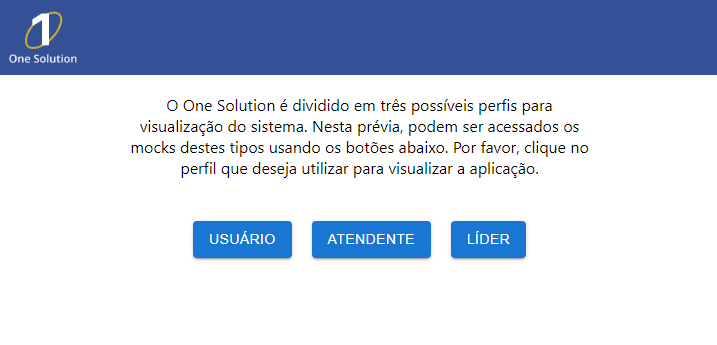
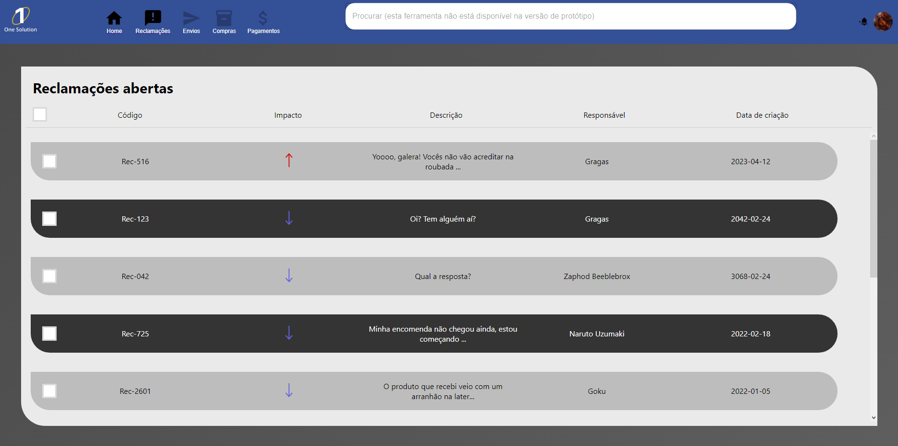
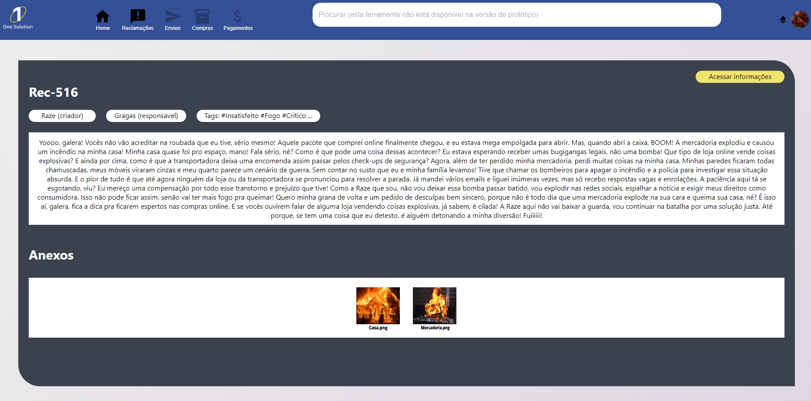
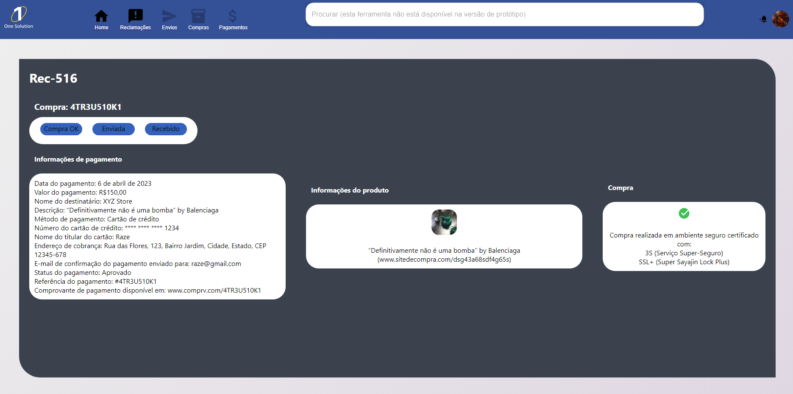
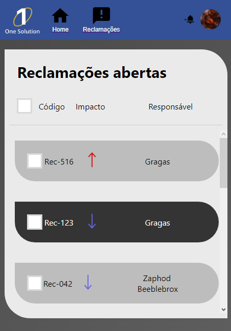
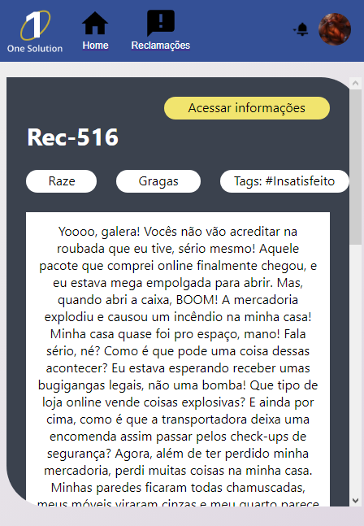
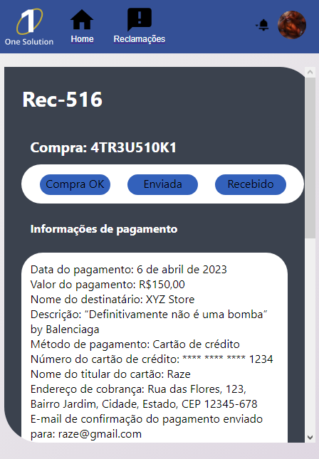

# One Solution

Aqui se encontra o front end do One Solution!

Este é apenas um protótipo isolado/MVP do que o sistema se propõem a realizar. Suas interações com um back end são inteiramente mockadas, contudo de acordo com os parâmetros desejados para um suposto back end. Foi decidido realizar este tipo de desenvolvimento para agilizar a criação da interface (UI/UX) sem depender imediatamente de um back end.

Este React App foi criado com a ajuda do [Create React App](https://github.com/facebook/create-react-app).

## Rodando o projeto

O projeto é feito inteiramente em ReactJS e não precisa de configurações anteriores para ser rodado. Basta ter NodeJS e as dependencias instaladas em sua máquina e rodar o comando "<i>npm start</i>". A aplicação então será inicializada em [http://localhost:3000](http://localhost:3000).

##

## Telas da aplicação e navegação

Por ser um protótipo, a aplicação teve várias de suas funções implementadas parcialmente ou apenas como mock (como, por exemplo as chamadas de API de microsserviços, que estão mockadas através de JSON embutidos no código).

A seguir temos as telas da aplicação e como navegar às telas de demonstração.

## Escolha de perfil

Como a aplicação teria diversos perfis de acesso, implementamos uma tela (que não estaria no produto final) para a escolha do perfil desejado para ver a aplicação. Cada um destes perfis levará o usuário a uma área diferente da solução.

  

##

## Área de atendentes

Esta é a área na qual a maior parte da plataforma se encontra, na qual os atendentes realizarão os atendimentos aos clientes e na qual pode pesquisar tickets e compras. É importante ressaltar que, como este é apenas um protótipo, algumas funções (como pesquisa, alguns botões e outros) não foram implementados. Estas funções possuem tooltips informando de sua "não implementação".

Nesta área, o header possui dois botões que não possui no perfil de "usuário": Home (que leva o usuário de volta para a tela de escolha de perfil) e Reclamações (que leva o usuário para a tela de lista de tickets). Os outros botões estão desativados pois se referem a funcionalidades fora do escopo deste protótipo.

### Lista de tickets

A primeira tela da área do atendente. Nela se encontram tickets abertos (que, na aplicação completa, seriam retirados de um microsserviço que teria as informações de tickets).

  

### Tela de informações de ticket

Para acessar esta tela, basta clicar no primeiro ticket da lista de tickets (como esta é uma tela mockada, apenas o primeiro ticket é um botão para esta tela, os outros não estando ativados).

Esta é a tela na qual se encontram as informações do ticket.

  

### Tela de informações de produto

Para acessar esta tela, basta clicar no botão "Acessar informações" da tela de informações de ticket.

Esta é a tela na qual se encontram as informações da compra por trás da abertura do ticket.

  

### Versão para mobile

Todas as telas dessa secção de "Atendente" são acessíveis e adaptáveis para mobile. Abaixo temos suas versões após o resize automático.

  

  

  

##
